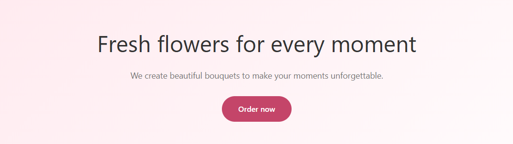
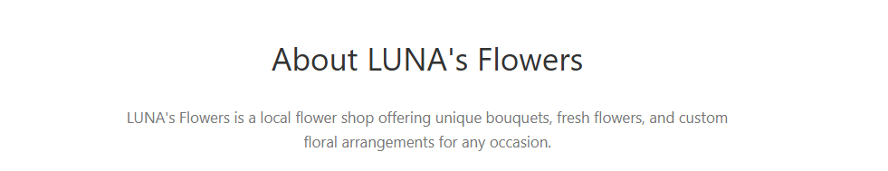
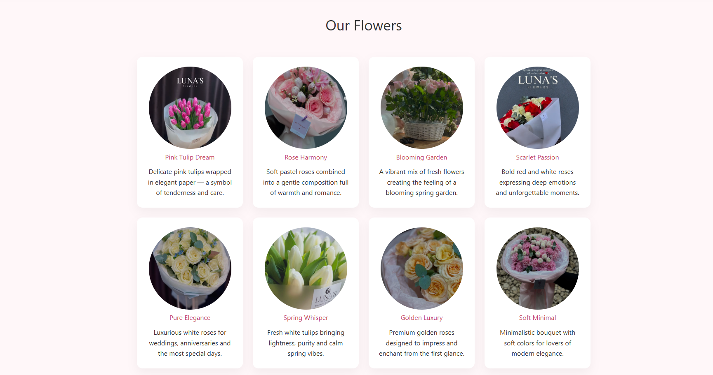
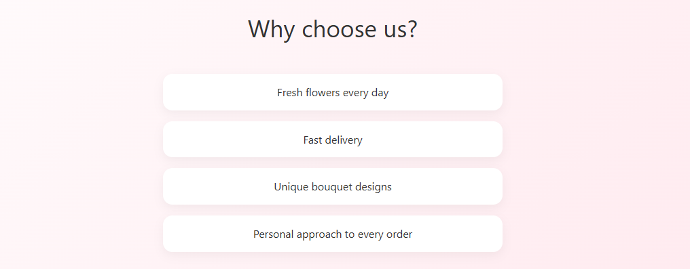
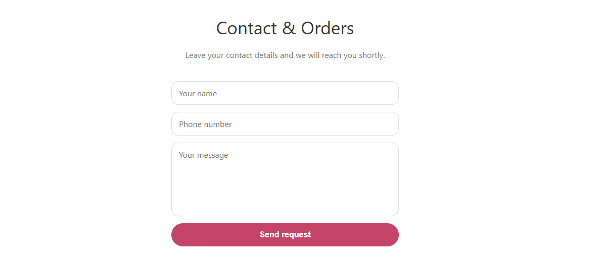

# Laboratory 2

## About the lab:
 Course: Web programming 
 Implementedd by: Titerez Vladislav
 Checked by: Pr. Străinu

## Topic
My family and relatives do not own any business, so I decided to create a landing page for my friend’s parents’ flower shop in Balti. They have an Instagram account, which I used as a reference. From there, I took the photos and the information.
Link: [Luna's Flowers](https://www.instagram.com/luna_s_flowers)

## Screenshots
So, according to the requirements I created five sections for my laning page:

### Home Section
This section serves as the first visual contact with the user. It contains a short slogan, a brief description of the flower shop, and a clear call-to-action button that encourages visitors to place an order or get in touch.

<figure>
  
  <figcaption><i>Figure 1 — Homepage (hero section)</i></figcaption>
</figure>

### About Section
The About section provides a short overview of LUNA's Flowers, presenting the shop's background, values, and main activity. Its goal is to build trust and give visitors a better understanding of the brand and its mission.

<figure>
  
  <figcaption><i>Figure 2 — About section</i></figcaption>
</figure>

### Products Section
This section showcases the main flower collections offered by the shop. It includes a grid layout with product cards, each displaying an image, a name, and a short description. The section is designed to visually engage users and help them explore the available floral arrangements.

<figure>
  
  <figcaption><i>Figure 3 — Products section</i></figcaption>
</figure>

### Why Us Section
The Why Us section highlights the key advantages of choosing LUNA's Flowers. It presents the main benefits, such as fresh flowers, fast delivery, unique designs, and personalized service, in a clear and easy-to-read format.

<figure>
  
  <figcaption><i>Figure 4 — Why Us section</i></figcaption>
</figure>

### Contact Section
This section contains a simple contact form that allows users to send inquiries or place orders. It includes input fields for name, phone number, and a message, providing a quick and convenient way to get in touch with the flower shop.

<figure>
  
  <figcaption><i>Figure 5 — Contact section</i></figcaption>
</figure>

## Demo Link
Here you can find a link to the project. It was deployed using GitHub pages.

- [https://vvtttvv.github.io/tum-web-lab2/](https://vvtttvv.github.io/tum-web-lab2/)

P.S. Thank you for visiting this repo and reading this repo ^^